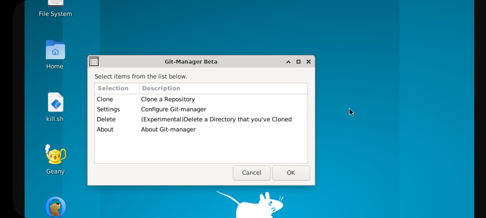
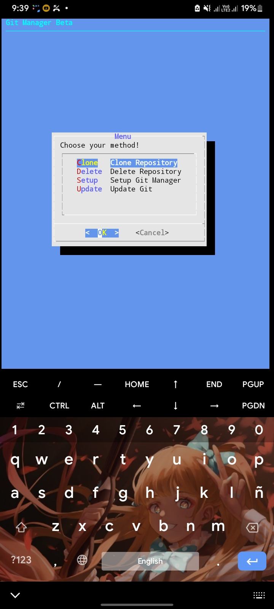

# Git-manager

A git managing tool for Debian/Ubuntu and Termux.

## Badges

 Available for:  ,  , 

 Available for:  ,  , 

## Choose Language if you don't know about English

- [Filipino](README_lang/README_fil-ph.md)
- [Español](README_lang/README_es-spn.md) (Need Correction)
- [Cebuano](README_lang/README_ceb-ph.md)
- [All Lists of Language](README/_lang/README_language-list.md)

## Features of Git-manager

- Can Git Clone at ease
- Can Configure Git by allowing to make `git push` configs

## Some Features may be added:

- Update Support

## Dependencies That will be Used

- Git (of course)
- dialog (For Command Line Prompt)
- zenity (X11 Version Only)

## Supported OS

- Debian
- Ubuntu
- Termux (Android)

## Installation

Basically, `init.sh` will install all required packages, if you have internet connection. so no need to type `apt install` except if you're on Debian/Ubuntu and not on root.

## Install on Debian/Ubuntu

This is how you will install the Repository in Debian/Ubuntu

```
  # Update your APT first
  apt update
  
  # Install Dependencies 
  sudo apt install git dialog zenity -y 
  
  # Clone the Project
  git clone https://github.com/SUFandom/git-manager
  
  # Go to git-manager folder
  cd git-manager
  
  # chmod init.sh 
  chmod +x init.sh 
  
  # Initialize init.sh 
  ./init.sh 
  
```

Then wait for a while and then there will be a dialog popup that will show you to what type of git-manager you want (Dialog/X11 Zenity)

(**IMPORTANT NOTE: YOU CAN'T INSTALL BOTH VERSIONS AS BOTH WILL BE REPLACED ANYWAYS**)

After you're done reading the License (im sure you dont) then the installer will try to extract the assets to working dirs and make config to work.

And done, you can summon the git-manager by:

```
  git-manager
```

### Issues with this Repository Under Ubuntu/Debian

- Zenity
    - When attempting to use this repository under VNC, zenity may not find the window session, there has been no fixes for that but you can use XServer XSDL or any other X Server Session. Although you could use xhost but it just makes the process too complicated.. 
    
      (Or install the Dialog Version Instead..)


## Installation on Termux 

For termux, its a piece of Cake, communicating with apt to install dependencies is easier because it doesn't need root when to do so

You can just do:

```
  # Updating Repository
  apt update
  
  # Installing Git
  apt install git -y
  
  # Clone
  git clone https://github.com/SUFandom/git-manager
  
  # Go to file
  cd git-manager
  
  # Elevate permission to Exec
  chmod +x init.sh 
  
  # Execute the file
  ./init.sh
```

And the script will try to install missing dependencies

After the brief process, you will be Greeted by Dialog Prompt, agreeing the license and then what version you want to install.. Dialog for Command Line Use only and for Zenity through X11 process

**NOTE: YOU CAN'T INSTALL BOTH VERSIONS AND WILL TRY TO OVERWRITE EXISTING INSTALLATION**

After the installation, you can use the script at your disposal..

## Screenshots


 Image:  *Zenity Git-manager Menu*
 
 

Image: *Dialog Git-manager Menu*


## Uninstall

This Project has an Uninstaller to just remove the files the Git-manager has installed, you can execute it by

```
  ./uninstall.sh 
```

Or maybe if you just deleted the project from your local dir, then you can try this:

```
  if (uname -a | grep "Android")
  then 
  rm -rf $PREFIX/bin/git-manager
  rm -rf $PREFIX/var/lib/git-manager/*
  exit
  else
  rm -rf /usr/bin/git-manager
  rm -rf /var/lib/git-manager/*
  exit
  fi
```

Copy the code and save to a text file then exec